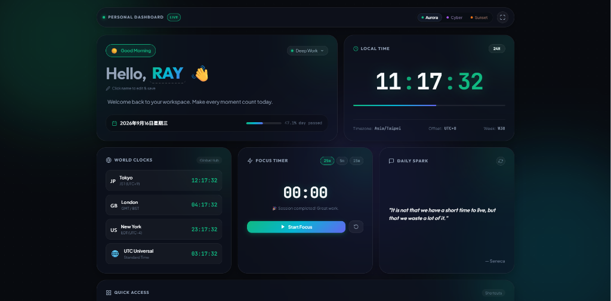

# RAYWU — Personal Page & Live Dashboard

An ambient, glassmorphic personal portfolio and live dashboard featuring real-time clock synchronization, developer profile, technical skill matrix, and featured project showcase.

## 🔗 Live Demo
Explore the live dashboard here: **[https://raywu576.github.io/916/](https://raywu576.github.io/916/)**

  

---

## 📌 Requirements Overview (基礎規格對應)

### 👤 1. Profile (個人自述)
- **姓名 (Name)**: RAYWU (支援點擊即時編輯與 `localStorage` 本機保存)
- **Avatar / 頭像**: 具備微光漸層動態效果的個人代表 Avatar
- **科系 / 專長 (Major & Expertise)**: 資訊工程系 / 軟體與前端工程 (Computer Science & Web Engineering)
- **自我介紹 (Bio)**: 熱愛軟體開發與現代互動介面，專注於高效能演算與極致 UI/UX 體驗

### 🛠️ 2. Skills (專業技能)
1. **Python**: 資料分析、自動化腳本、演算法實作與後端應用
2. **C / C++**: 系統底層概念、指標運作、高效能資料結構與核心演算法
3. **Modern Web (HTML5 / CSS3 / JavaScript ES6+)**: 現代語意化網頁、Glassmorphism 毛玻璃特效、響應式 Bento Grid
4. **Machine Learning**: 機器學習基礎流程、特徵工程與模型評估指標
5. **Git & Version Control**: 分散式版本控制、分支管理、GitHub Pages 線上部署

### 🚀 3. Projects (專案作品介紹)
- **專案名稱 (Project Name)**: Personal Dashboard & Live Clock (916)
- **專案簡介 (Project Description)**: 一款暗黑極光氛圍與高級毛玻璃質感的個人數位儀表板。具備毫秒級高精度數位時鐘、12/24小時制切換、全球主要時區即時換算（東京、倫敦、紐約、UTC）、自訂專注番茄鐘、動態時段問候與 LocalStorage 個人化狀態保存。
- **使用技術 (Tech Stack)**:
  - `HTML5` (語意化架構、無障礙設計)
  - `CSS3` (Glassmorphism 毛玻璃、CSS 變數主題切換、流動極光動畫、Bento Grid 響應式佈局)
  - `JavaScript (ES6+)` (高精度計時迴圈、Intl 多國時區 API、Web Storage API)
  - `Git & GitHub Pages` (版本控制與自動化雲端網頁部署)
- **線上展示**: [https://raywu576.github.io/916/](https://raywu576.github.io/916/)
- **原始碼**: [https://github.com/RayWu576/916](https://github.com/RayWu576/916)

---

## 🚀 Getting Started

Simply open [`index.html`](index.html) in any modern web browser, or view it directly on [GitHub Pages](https://raywu576.github.io/916/).
